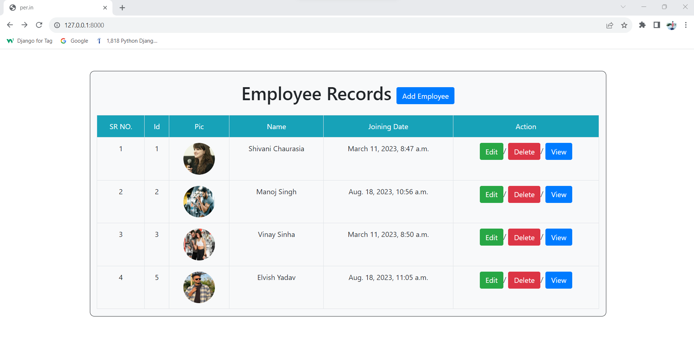
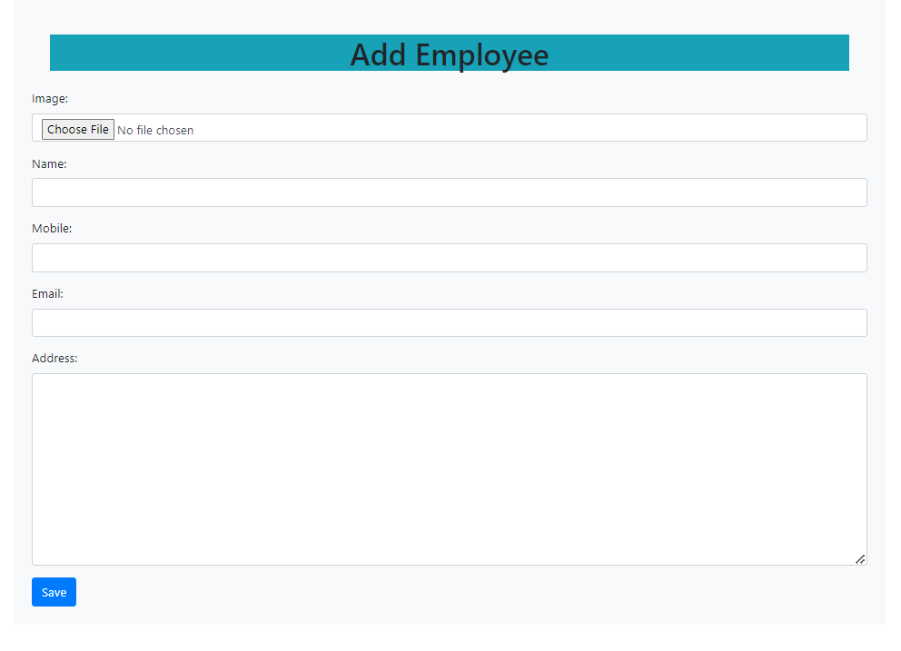
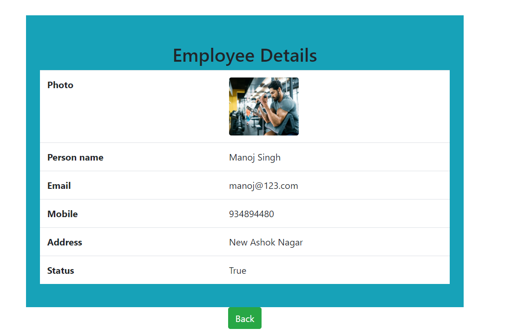
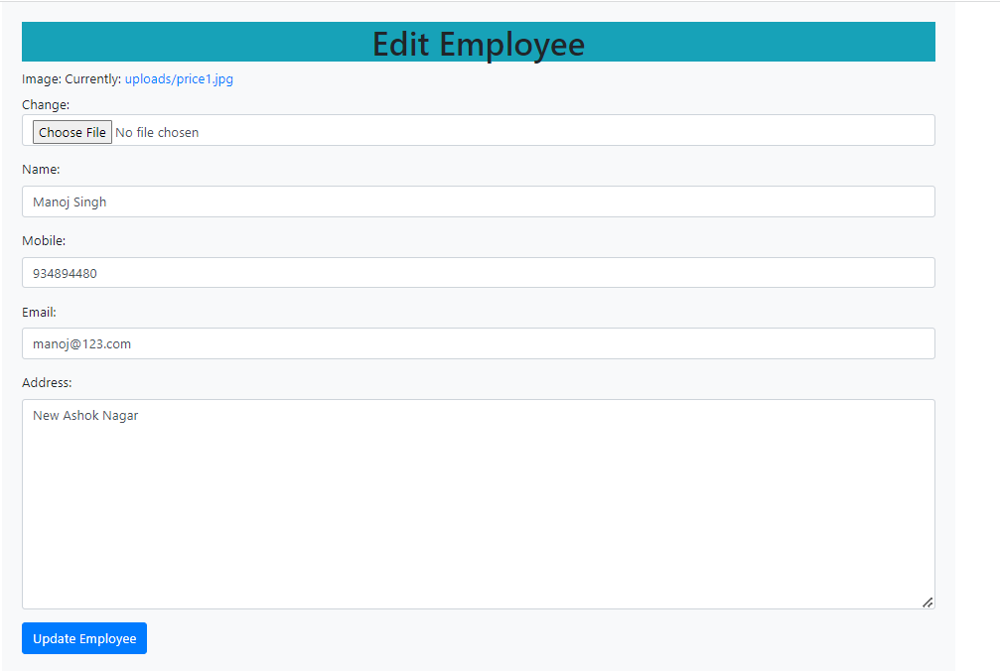

# Employee_Management_System
#Django CRUD Project (Create, Retrieve, Update, Delete)

##Features of Project:-

1.Create – create or add new entries in a table in the database. 

2.Retrieve – read, retrieve, search, or view existing entries as a list(List View) or retrieve a particular entry in detail (Detail View) 

3.Update – update or edit existing entries in a table in the database 

4.Delete – delete, deactivate, or remove existing entries in a table in the database

#cmd-pip freeze

asgiref==3.6.0

Django==4.1.7

Pillow==9.4.0

sqlparse==0.4.3

tzdata==2022.7
